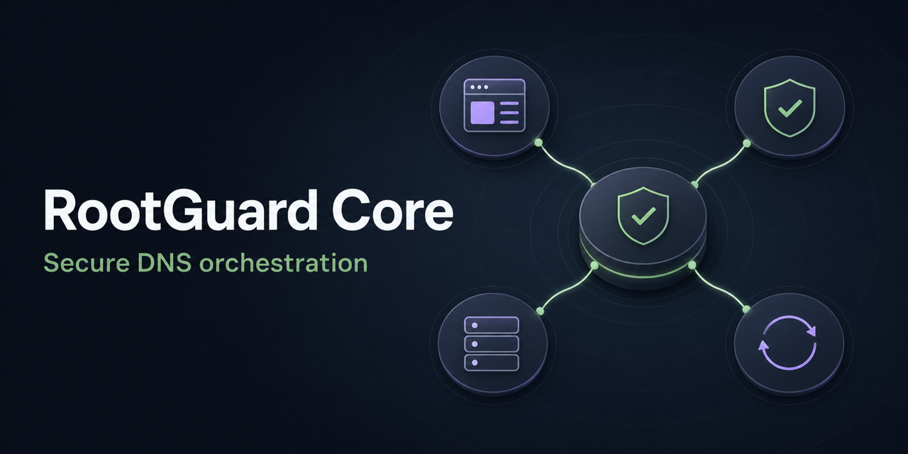

# RootGuard Core



**RootGuard Core is the authenticated control plane behind the RootGuard
self-hosted DNS stack.** It deploys and manages AdGuard Home and Unbound,
validates configuration changes, monitors the DNS chain, and performs protected
updates with automatic rollback.

[](https://github.com/foxly-it/rootguard-core/actions/workflows/ci.yml)
[](go.mod)
[](LICENSE)
[](https://github.com/foxly-it/rootguard)

[RootGuard](https://github.com/foxly-it/rootguard) ·
[Website](https://rootguard.foxly.de/) ·
[Architecture](https://github.com/foxly-it/rootguard/blob/main/docs/architecture.md) ·
[Roadmap](https://github.com/foxly-it/rootguard/blob/main/ROADMAP.md)

> [!IMPORTANT]
> Core is an internal service and must not be exposed directly to a LAN or the
> internet. Use the complete RootGuard Compose stack for an end-user setup.

## What Core does

- Deploys the managed AdGuard Home and Unbound DNS data plane.
- Generates, previews, validates, versions, and restores Unbound configuration.
- Verifies DNS resolution, DNSSEC rejection, and the protected AdGuard upstream.
- Creates backups before service updates and rolls back failed replacements.
- Coordinates atomic Core/WebApp updates through the independent updater path.
- Keeps images, mounts, Compose content, and executable commands out of browser
  input.

```text
Browser → RootGuard WebApp → RootGuard Core → Docker API
                                      ├── AdGuard Home
                                      └── Unbound
```

## Local development

Requirements: Go 1.26+, Docker Engine, and a local RootGuard development
environment.

```sh
git clone https://github.com/foxly-it/rootguard-core.git
cd rootguard-core
go test ./...
go vet ./...
go build ./...
```

Run Core with a random internal API token:

```sh
ROOTGUARD_API_TOKEN="$(openssl rand -hex 32)" go run ./cmd/rootguard
```

Core listens on port `8081` by default. Except for `/api/health`, routes require
`Authorization: Bearer <ROOTGUARD_API_TOKEN>`.

For the complete development stack, clone the
[RootGuard main repository](https://github.com/foxly-it/rootguard) with its
submodules and run `docker compose up --build -d`.

## API areas

| Area | Responsibility |
| --- | --- |
| Installation | Preflight checks, persistent progress, managed DNS deployment |
| Unbound | Settings, preview, validation, history, restore, diagnostics |
| AdGuard Home | Bootstrap, health, protected administration proxy |
| Service lifecycle | Allowlisted image checks, backup, update, rollback |
| Control plane | Paired Core/WebApp update requests and status |

Every configuration change is validated before activation. If Unbound cannot
restart or the DNS chain fails its health checks, Core restores the previous
known-good state.

## Security model

- Token-authenticated internal API with a minimal public health endpoint.
- No UI rendering and no user-supplied container specifications.
- Allowlisted services, images, paths, and operations.
- Deterministic configuration generation and bounded version history.
- Backup-backed updates with DNS and DNSSEC verification.

See the project
[architecture documentation](https://github.com/foxly-it/rootguard/blob/main/docs/architecture.md)
for trust boundaries and network design.

## Contributing

Read [CONTRIBUTING.md](CONTRIBUTING.md) before opening a pull request. Good
starting points are issues labeled
[`good first issue`](https://github.com/foxly-it/rootguard-core/labels/good%20first%20issue)
or [`help wanted`](https://github.com/foxly-it/rootguard-core/labels/help%20wanted).
Report security vulnerabilities privately as described in
[SECURITY.md](SECURITY.md).

## License

RootGuard Core is licensed under
[GNU AGPL-3.0-or-later](LICENSE). The software license does not grant rights to
the RootGuard or Foxly IT names or logos.
